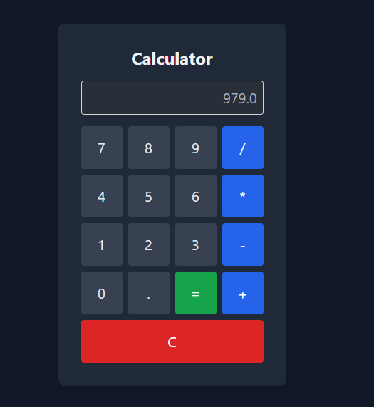

# HTMX Calculator

A simple calculator web application built using Django and HTMX. 

## Features

- Basic arithmetic operations: addition, subtraction, multiplication, division
- Decimal point handling

## Screenshots


## Installation

To set up the project locally, follow these steps:

1. **Clone the Repository**

   ```bash
   git clone https://github.com/Vic123333/HTMX_Calculator
2. **Python  migrate**
   ```bash
   python manage.py migrate
   python manage.py makemigrations

4. **runserver**
   ```bash
   python manage.py runserver
